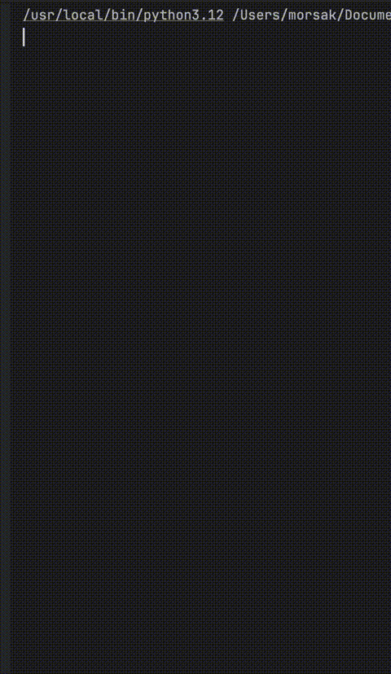

# Robot in the Terminal — CS Learning Project

Welcome! This project is a hands-on, terminal-based programming journey where you’ll learn Computer Science by building and exploring a robot simulation step by step.

## Overview

You’ll create a robot that moves around a grid in your terminal, avoids obstacles, reaches a goal, and interacts with simple AI “NPCs.”  
Each part introduces new CS concepts in a fun, practical way — perfect for ages 16–19 and beginner programmers.

---

## Repository Structure

```plaintext
.
├── part1_variables_constructor_functions
│ ├── README.md          # Instructions for Part I
│ └── robot.py           # Student TODO code
├── part2_loops_random
│ ├── README.md
│ └── robot.py
├── part3_if_else_error
│ ├── README.md
│ └── robot.py
├── part4_data_structures
│ ├── README.md
│ └── robot.py
├── part5_npc_strategies
│ ├── README.md
│ └── robot.py
```

## Learning Outcomes

- Variables and data types
- Classes and object-oriented programming
- Loops, randomization, and basic AI
- If-else logic and error handling
- Data structures (lists, grids)
- Functions/methods and code organization



### **Happy Coding! 🚀**
